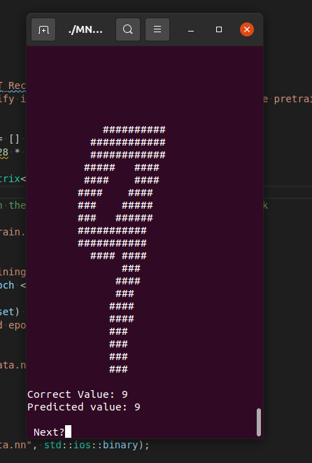

# MNIST_Recognition
A self made neural network made for recognizing single digits. My library is required for compilation. This project isn't anything practical. since it's used for demontrating the neural network parts of the library.

# Preview

